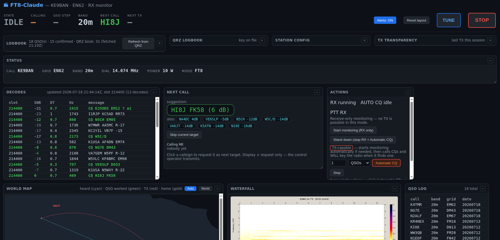
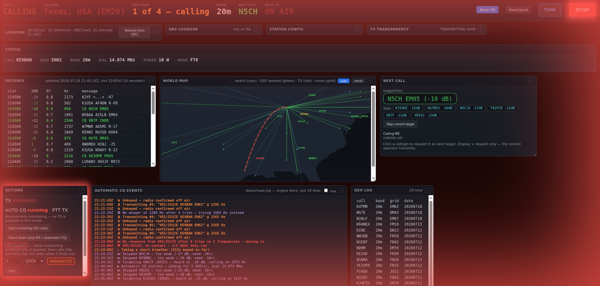

# SeeQ — a Claude-built, attended FT8 station for Linux hams 📻

**A digital on-the-air system for HAM radio, built by Claude — you're always the operator,
Claude never keys the transmitter.** *(SeeQ, as in "CQ" — formerly named COTA.)*

[](https://github.com/d4rkd0s/seeq/actions/workflows/test.yml)

**Decode, chase, and log FT8 QSOs from the command line**, with a live browser
dashboard: waterfall, offline world map, decode list, QSO log, and next-call
ranking. Born on 40 m with a Xiegu G90 + DE-19 interface at 5 W — but every
station-specific value lives in one config file, so it runs on **any
Hamlib-controllable rig** with a USB audio interface.

This station was designed, written, debugged, and first operated by Claude
(Anthropic's AI) working under a licensed ham's supervision — and then made
**claude-less at runtime**: no AI, no cloud, no tokens, no network calls. What
runs in your shack is plain bash + Python 3 + the WSJT-X command-line tools.
First contact: VE2OPC (FN45), 2026-07-04, 40 m, 5 W, worked and logged entirely
by this code while the control operator watched.

**Operating cost: $0/hour — no AI subscription needed, ever.** See
[docs/COST.md](docs/COST.md) for the measured cost model (what building it with a
frontier model actually cost, and how to hack on it for cents or for free with
local models).




## ⚠️ Safety model — read this first

**Claude does not transmit. Ever.** Claude built this software; it does not
operate it. The licensed control operator runs the commands that operate the
station (`seeq start`, `seeq chase N`, …) — every key-up on the air is a human
decision, executed by human-run code, never an AI acting on its own.

**You must be a licensed radio amateur, and you are the control operator.**
FCC Part 97 (and most national regulations) make a licensed operator
responsible for every transmission. This software is **attended
semi-automation** — the same class of tool as WSJT-X's auto-sequencer, not an
unattended robot. Stay at the station whenever the chaser is running.

Built-in rails, all enforced in code:

- **Answerer only — it never calls CQ.** The chaser answers other stations'
  CQs and sequences a standard QSO to 73. It initiates nothing on its own.
- **Independent unkey watchdog** armed *before* every key-up (default 14 s; an
  FT8 frame is 12.64 s). Even if the main process dies mid-frame, the watchdog
  releases PTT.
- **Frequency read-back before every key-up** — `rigctl f` must return exactly
  the configured dial, or the frame is aborted without keying.
- **PTT release verified** after every frame; a stuck PTT aborts the session.
- Same-frame **repeat cap** (default 6), per-target patience limit, and an
  absolute per-session TX frame budget.
- **No same-day dupes**, courtesy 73, even/odd slot discipline, clear-offset
  (split) calling, and breather pauses — see the etiquette section below.
- Ctrl-C, `seeq stop`, and the watchdog all force-release PTT.

**QRP / duty-cycle warning:** FT8 is a 100%-duty-cycle mode for ~13 s per
frame, and a chase session keys many frames. Small rigs like the G90 run hot —
set `TX_PWR` conservatively (5–10 W), keep SWR low, and give the radio
breathing room. You are responsible for staying within your license privileges
and your hardware's limits.

## Requirements

Built and tested on Ubuntu 22.04 LTS (Jammy Jellyfish), kernel 5.15.0-185-generic —
should work on any modern Linux distro with the packages below; not tested on macOS/BSD.

- Linux with PulseAudio (or PipeWire's PulseAudio shim)
- **WSJT-X package** — this project *calls* its GPL `jt9` decoder and
  `ft8code` encoder as external programs; they are not bundled or linked
- Hamlib (`rigctl`), `sox`, Python 3 + numpy
- A CAT-controllable radio and a USB audio interface wired to it
  (DE-19, Digirig, SignaLink, built-in USB codec, …)
- An NTP-synced clock — FT8 needs < 1 s accuracy (`timedatectl`)

```bash
sudo apt-get install wsjtx sox pulseaudio-utils python3-numpy libhamlib-utils
```

## Quick start

```bash
bin/seeq setup          # interactive wizard: detect hardware, write station.conf
bin/seeq selftest       # offline decode-chain check — no radio needed
bin/seeq doctor         # preflight diagnostics with fix-hints
bin/seeq start          # preflight checks, RX loop, dashboard at http://localhost:8074
bin/seeq chase 3        # answer CQs until 3 QSOs are logged — stay at the radio!
bin/seeq chase 20m      # ...or chase for 20 minutes
bin/seeq status         # one-screen station status
bin/seeq report         # compact session report: QSOs, attempts, per-band
bin/seeq stop           # stop everything, force PTT release
```

`seeq start` alone is receive-only and needs no attention: it decodes, plots,
and suggests — but never transmits. Full per-distro install steps (including
Raspberry Pi OS) are in [docs/INSTALL.md](docs/INSTALL.md).

## Architecture

```
rig ──USB audio──> PulseAudio ──parecord 12 kHz──> data/slot.wav (per 15 s slot)
                                     │
                    jt9 -8 (WSJT-X CLI decoder — best sensitivity)
                    sox spectrogram → data/waterfall.png
                                     │
                    bin/rx-loop.sh → data/decodes/YYYY-MM-DD/HH.jsonl + data/status.json
                                     │
                    bin/dashboard.py (http://localhost:8074) ← your browser
                                     │
        bin/qso.py chaser: pick CQ (SNR minus pileup penalty)
        ─ft8code + GFSK synth─> TX WAV ─rigctl verify freq → key →
        paplay → unkey (independent watchdog)─> rig TX
                                     │
        QSOs ──> wsjtx_log.adi (standard ADIF — imports anywhere)
```

The GFSK modulator (`tools/ft8synth.py`) is ~100 lines of numpy built from the
FT8 spec (8-FSK, 6.25 baud, BT=2 Gaussian pulse, Costas sync), verified by
loopback against `jt9` at DT 0.00. The sequencer's pure logic is unit-tested
(`python3 tools/test_sequencer.py`).

## The dashboard

`bin/dashboard.py` is Python 3 standard library only — no frameworks, no JS
build, and **zero external requests** (the world coastline is Natural Earth
110m public-domain data embedded in `bin/world_map.py`), so it works in an
offline shack. Panels: live waterfall, world map (heard stations plotted from
their grid squares, fading over ~15 min; your QTH gold; an animated red arc to
the station being worked while the rig is keyed), decode table, callers-to-you,
QSO log, next-call suggestion, and the chaser's event diary. See it live in
the screenshots near the top of this README.

## On-air etiquette

The chaser's behavior follows the widely used
[ZL2IFB FT8 Operating Guide](https://www.g4ifb.com/FT8_Hinson_tips_for_HF_DXers.pdf)
by Gary Hinson ZL2IFB:

- **Split calling only** — picks its own clear TX offset (≥ 60 Hz clearance,
  parity-aware), never calls on the DX's frequency
- **Busy-hold** — if the target answers someone else, it holds fire instead of
  QRMing, and moves on after repeated cycles
- **Directed-CQ respect** — never answers `CQ DX` or contest CQs by default;
  answers only plain CQs and a configurable modifier whitelist (POTA, QRP,
  your region, …). DX Mode (dashboard toggle, per session) lifts the `CQ DX`
  skip and restricts candidates to stations outside your own country/DXCC
  entity — every other rail below still applies.
- **SNR floor** — doesn't call stations too weak to plausibly hear a QRP reply
- Stalled-QSO recovery, slot-parity tracking, and periodic breathers so it
  never dominates a frequency

## Releases

SeeQ ships early and often — every merged change gets a semver tag and a GitHub
Release. Full release notes: [github.com/d4rkd0s/seeq/releases](https://github.com/d4rkd0s/seeq/releases).

| Version | Date | What shipped |
|---|---|---|
| [v2.6.0](https://github.com/d4rkd0s/seeq/releases/tag/v2.6.0) | 2026-07-25 | Moon widget, logo, QRZ auto-sync default-on, Freq Lock auto-correct, decode-list country flags, mode chooser descriptions |
| [v2.5.0](https://github.com/d4rkd0s/seeq/releases/tag/v2.5.0) | 2026-07-25 | SeeQ logo image assets |
| [v2.4.0](https://github.com/d4rkd0s/seeq/releases/tag/v2.4.0) | 2026-07-25 | Mode roadmap descriptions (`MODE_INFO`) for the boot chooser |
| [v2.3.0](https://github.com/d4rkd0s/seeq/releases/tag/v2.3.0) | 2026-07-25 | Sun/moon ephemeris math library |
| [v2.2.0](https://github.com/d4rkd0s/seeq/releases/tag/v2.2.0) | 2026-07-25 | QRZ upload comment enrichment (SeeQ version + worked country) |
| [v2.1.0](https://github.com/d4rkd0s/seeq/releases/tag/v2.1.0) | 2026-07-25 | DX-aware candidate ranking for normal (non-DX-only) chase mode |
| [v2.0.1](https://github.com/d4rkd0s/seeq/releases/tag/v2.0.1) | 2026-07-25 | Fix: TX abort on harmless CAT read-back jitter, not just a real mistune |
| [v2.0.0](https://github.com/d4rkd0s/seeq/releases/tag/v2.0.0) | 2026-07-23 | Rebrand COTA → SeeQ, strict FCC compliance engine, BandPulse XSS fix, mode-chooser resize |

<details>
<summary>Earlier releases (v1.0.0 – v1.9.0)</summary>

| Version | Date | What shipped |
|---|---|---|
| [v1.9.0](https://github.com/d4rkd0s/seeq/releases/tag/v1.9.0) | 2026-07-22 | Live BandPulse HF band-conditions banner + dynamic header status |
| [v1.8.0](https://github.com/d4rkd0s/seeq/releases/tag/v1.8.0) | 2026-07-20 | M0 mode-switching machinery (registry, deliberate changeover, boot chooser), Call-this-station immediate-start fix, unkey countdown |
| [v1.7.1](https://github.com/d4rkd0s/seeq/releases/tag/v1.7.1) | 2026-07-19 | Fix: false-success feedback when picking a target while chaser is idle |
| [v1.7.0](https://github.com/d4rkd0s/seeq/releases/tag/v1.7.0) | 2026-07-19 | Map revamp — country/state borders, pan/zoom, clickable dots, country card |
| [v1.6.0](https://github.com/d4rkd0s/seeq/releases/tag/v1.6.0) | 2026-07-19 | Shorten retry budget on current target when another station is calling us |
| [v1.5.0](https://github.com/d4rkd0s/seeq/releases/tag/v1.5.0) | 2026-07-19 | Live SNR-floor slider; cockpit state timing + new-country flash fixes |
| [v1.4.1](https://github.com/d4rkd0s/seeq/releases/tag/v1.4.1) | 2026-07-19 | Map TX-line staleness/gridless-target bugfix, DX skip-reason logging split |
| [v1.4.0](https://github.com/d4rkd0s/seeq/releases/tag/v1.4.0) | 2026-07-18 | DX Mode: country/DXCC candidate filter + CQ-DX un-gate, toggle + confirm modal |
| [v1.3.2](https://github.com/d4rkd0s/seeq/releases/tag/v1.3.2) | 2026-07-18 | DXCC prefix gap-fill, repo-wide TDD mandate |
| [v1.3.1](https://github.com/d4rkd0s/seeq/releases/tag/v1.3.1) | 2026-07-18 | Real dashboard screenshots in the README |
| [v1.3.0](https://github.com/d4rkd0s/seeq/releases/tag/v1.3.0) | 2026-07-18 | Fix CI badge (numpy/interpreter mismatch), +19 pipeline tests |
| [v1.2.2](https://github.com/d4rkd0s/seeq/releases/tag/v1.2.2) | 2026-07-18 | Explicit "Claude never transmits" framing |
| [v1.2.1](https://github.com/d4rkd0s/seeq/releases/tag/v1.2.1) | 2026-07-18 | Open-source polish — screenshot slot, MISSION.md, OS requirements |
| [v1.2.0](https://github.com/d4rkd0s/seeq/releases/tag/v1.2.0) | 2026-07-12 | QRZ Logbook sync + confirmation-aware logbook |
| [v1.1.0](https://github.com/d4rkd0s/seeq/releases/tag/v1.1.0) | 2026-07-11 | Station config UI, TX-flow fixes, live-session UX polish |
| [v1.0.0](https://github.com/d4rkd0s/seeq/releases/tag/v1.0.0) | 2026-07-11 | First tagged release — target selection, rotating decode logs, TX transparency + station config UI |

</details>

## Roadmap — what's coming next

Full detail lives in [docs/ROADMAP.md](docs/ROADMAP.md) (the $0-cost build process) and
[docs/MODES-ROADMAP.md](docs/MODES-ROADMAP.md) (which digital modes SeeQ drives, and why).

- **Next up — JS8 mode (M1).** The mode-switching seam (registry, deliberate
  power-down/power-up changeover, boot chooser) shipped in v1.8.0 specifically to make
  this possible. JS8 adds free-text messaging and store-and-forward alongside FT8 — new
  engine, new dashboard panel, same frozen TX-safety chain and control-operator sign-off
  FT8 had before its first on-air key-up.
- **After that — email over radio (Winlink, M2).** Design already researched and settled
  (Pat + ardopcf + a shared `rigctld`), not yet installed — see
  [`skills/email-over-radio.md`](../skills/email-over-radio.md) in the parent `~/Radio` tree.
- **Backlog:** UI-string translation for non-US operators (the DX/candidate-ranking logic
  itself is already callsign-derived and works for any country out of the box — this is
  display-string i18n only); community polish (issue templates, demo GIF, forum
  announcement).

## License

MIT — see [LICENSE](LICENSE). Copyright 2026 Logan Schmidt.

`jt9` and `ft8code` are part of [WSJT-X](https://wsjt.sourceforge.io) (GPL),
which you install separately from your distribution; this project invokes them
as external command-line programs and does not bundle, modify, or link against
them. Not affiliated with the WSJT-X project. World map data is Natural Earth
(public domain). Thanks to Gary Hinson ZL2IFB for the FT8 Operating Guide that
shaped the etiquette engine, and to the WSJT-X team for the mode and the tools.

---
*73 — Logan (and Claude)*
